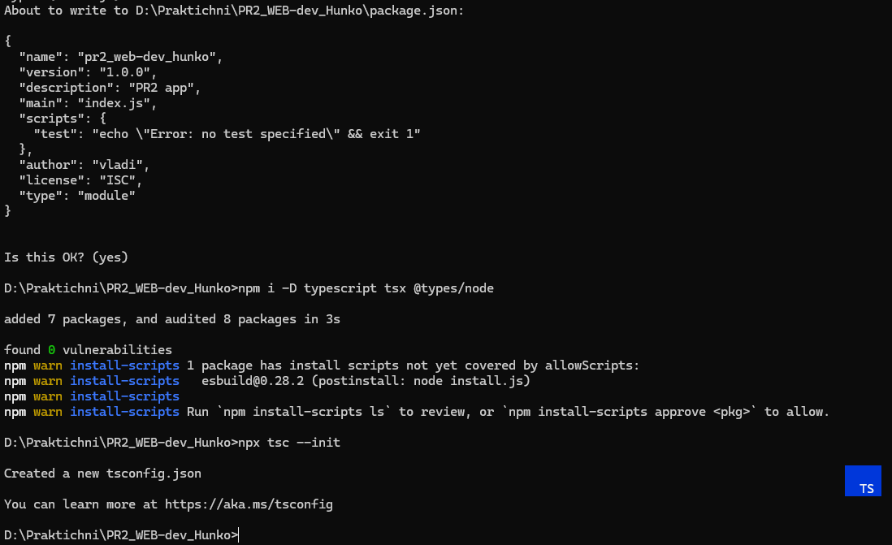
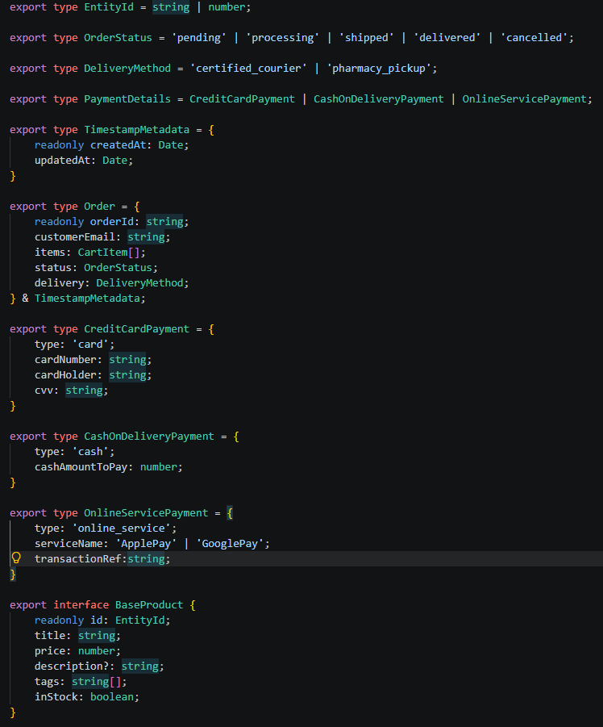
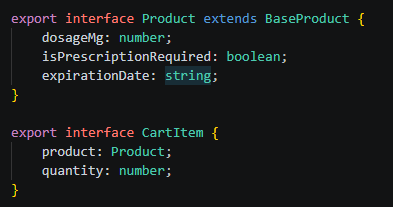
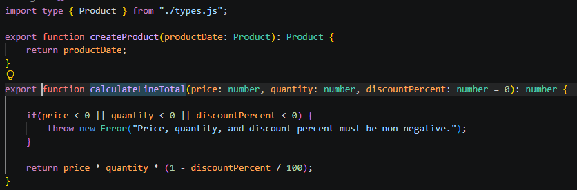
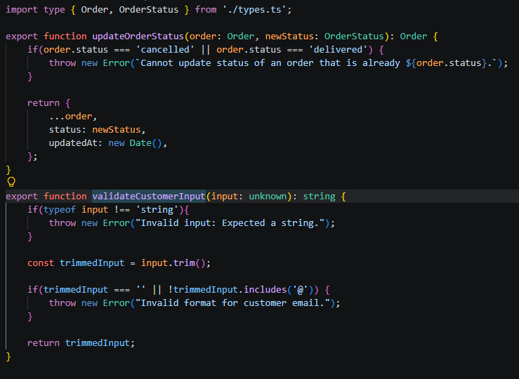
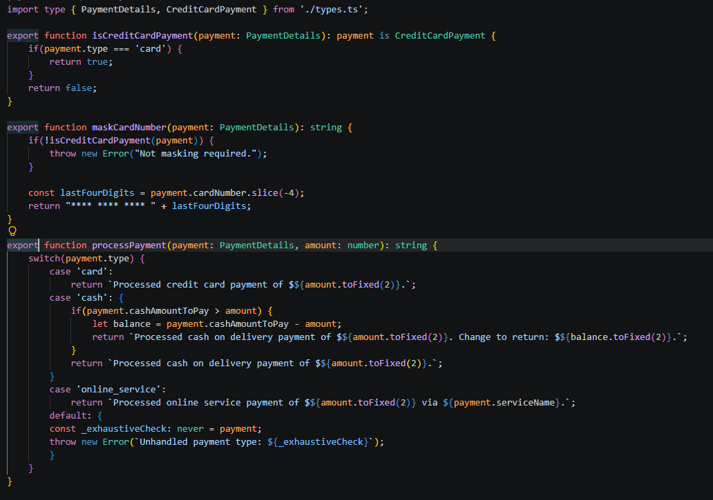
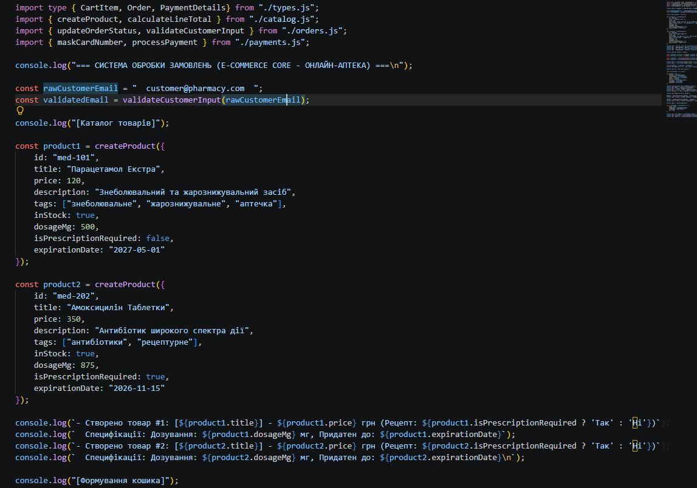
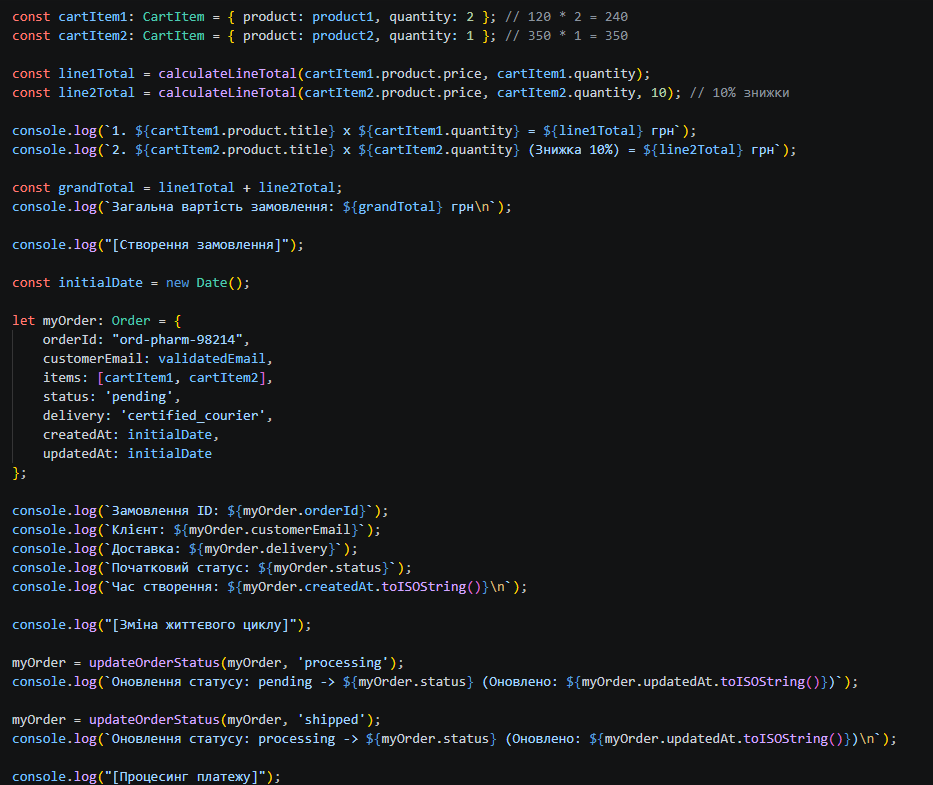
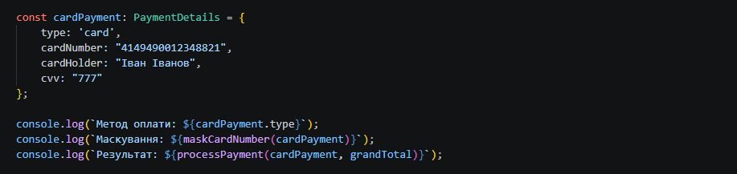
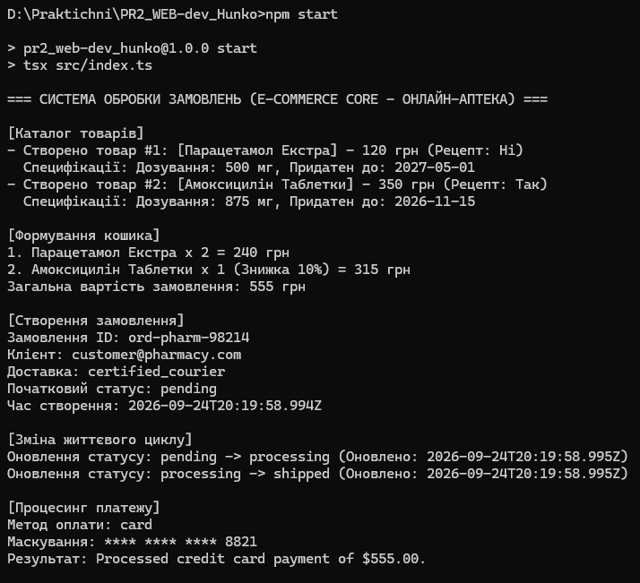

# Практична робота № 2

## Тема: Базові засоби системи типів TypeScript

**Варіант:** 5 — Онлайн-аптека

---

## Мета роботи

- Опанувати синтаксис та базові інструменти типізації мови TypeScript, налаштувати середовище проєкту із суворим режимом компіляції (`tsconfig.json`).
- Навчитися моделювати предметні області за допомогою примітивних типів, кортежів (tuples), псевдонімів типів (type aliases) та інтерфейсів (interfaces).
- Засвоїти механізми комбінування типів через об'єднання (unions) та перетин (intersections).
- Опанувати техніки звуження типів (type narrowing), роботу з розпізнаваними об'єднаннями (discriminated unions), розробку користувацьких захисників типу (custom type guards) та вичерпну перевірку (exhaustiveness check) через тип `never`.

## Технічне забезпечення

- Операційна система: Windows, macOS або Linux.
- Середовище розробки: Visual Studio Code (із розширенням TypeScript and JavaScript Language Features).
- Платформа виконання: Node.js версії 18+ (LTS) та пакетний менеджер npm.
- Інструменти компіляції та виконання: TypeScript (`tsc`) та швидкий запускач `tsx`.
- Термінал / CLI: bash, zsh або PowerShell.
- Система контролю версій: Git.

---

## Опис проєкту

Проєкт — модуль **типізованого ядра системи інтернет-магазину (E-Commerce Core Engine)** для предметної області **«Онлайн-аптека»** (варіант 5). Модуль моделює каталог товарів, кошик покупок, життєвий цикл замовлення та різні способи оплати. Уся бізнес-логіка написана з суворою типізацією, **без використання типу `any`**.

Специфіка варіанта 5:

| Параметр | Значення |
| --- | --- |
| Категорія магазину | Онлайн-аптека |
| Специфічні характеристики товару | `dosageMg: number`, `isPrescriptionRequired: boolean`, `expirationDate: string` |
| Варіанти доставки | `'certified_courier'` та `'pharmacy_pickup'` |

Точка входу `src/index.ts` демонструє повний сценарій: створення двох товарів, формування кошика зі знижкою, створення замовлення, зміну його статусу та оплату банківською карткою.

---

## Функціонал

Практична робота складається з трьох послідовних рівнів; кожен наступний розширює попередній.

### Рівень 1. Структура проєкту та моделювання сутностей

| Елемент | Файл | Призначення |
| --- | --- | --- |
| `EntityId` | `types.ts` | Ідентифікатор сутності: об'єднання `string` та `number` |
| `BaseProduct` | `types.ts` | Базовий інтерфейс товару: `readonly id`, `title`, `price`, `description?` (опціональне), `tags: string[]`, `inStock` |
| `Product` | `types.ts` | Розширює `BaseProduct` полями варіанта: `dosageMg`, `isPrescriptionRequired`, `expirationDate` |
| `createProduct()` | `catalog.ts` | Створення сутності товару зі строгою типізацією параметра та типу, що повертається |
| `calculateLineTotal()` | `catalog.ts` | Вартість позиції з урахуванням знижки (параметр `discountPercent` за замовчуванням `0`). Від'ємні ціна, кількість або знижка — кидається `Error` |

### Рівень 2. Гнучка типізація (unions, intersections) та безпечна обробка даних

| Елемент | Файл | Призначення |
| --- | --- | --- |
| `OrderStatus` | `types.ts` | Літеральний union: `pending`, `processing`, `shipped`, `delivered`, `cancelled` |
| `DeliveryMethod` | `types.ts` | Літеральний union способів доставки: `certified_courier`, `pharmacy_pickup` |
| `CartItem` | `types.ts` | Позиція кошика: `product: Product` та `quantity: number` |
| `TimestampMetadata` | `types.ts` | Аудит-мітки: `readonly createdAt` та `updatedAt` |
| `Order` | `types.ts` | Повна модель замовлення, створена **перетином типів** (`&`) з `TimestampMetadata` |
| `updateOrderStatus()` | `orders.ts` | Чиста функція: повертає **новий** об'єкт замовлення з оновленими `status` та `updatedAt`. Замовлення у статусах `cancelled` та `delivered` змінювати заборонено (кидається `Error`) |
| `validateCustomerInput()` | `orders.ts` | Приймає `unknown`; через звуження типу (`typeof`) перевіряє, що це непорожній рядок із символом `@`, і повертає очищений (`trim`) рядок. Якщо вхід не є рядком — кидається виключення |

### Рівень 3. Discriminated Unions, Type Guards та Exhaustive Check

| Елемент | Файл | Призначення |
| --- | --- | --- |
| `CreditCardPayment` | `types.ts` | Оплата карткою, дискримінатор `type: 'card'` |
| `CashOnDeliveryPayment` | `types.ts` | Оплата готівкою при отриманні, дискримінатор `type: 'cash'` |
| `OnlineServicePayment` | `types.ts` | Оплата через онлайн-сервіс (`ApplePay` або `GooglePay`), дискримінатор `type: 'online_service'` |
| `PaymentDetails` | `types.ts` | Розпізнаване об'єднання (discriminated union) усіх трьох способів оплати |
| `isCreditCardPayment()` | `payments.ts` | Користувацький захисник типу (`payment is CreditCardPayment`), перевіряє `type === 'card'` |
| `maskCardNumber()` | `payments.ts` | Викликає type guard; для банківської картки повертає маску виду `**** **** **** 8821` (видно лише останні 4 цифри). Для інших способів оплати маскування не застосовується |
| `processPayment()` | `payments.ts` | Обробка платежу через `switch (payment.type)` з вичерпною перевіркою: у гілці `default` змінна `_exhaustiveCheck: never` гарантує, що всі варіанти `PaymentDetails` оброблено |

### Використані можливості системи типів

| Концепція | Де застосовано |
| --- | --- |
| Строгий режим (`strict`, `noImplicitAny`) | `tsconfig.json` |
| Union-тип | `EntityId`, `OrderStatus`, `DeliveryMethod`, `PaymentDetails` |
| Intersection-тип | `Order = {...} & TimestampMetadata` |
| Інтерфейси та успадкування | `BaseProduct` → `Product`, `CartItem` |
| Опціональні поля та `readonly` | `description?`, `id`, `orderId`, `createdAt` |
| Тип `unknown` та type narrowing | `validateCustomerInput()` |
| Discriminated union | `PaymentDetails` (дискримінатор `type`) |
| Custom type guard | `isCreditCardPayment()` |
| Exhaustiveness check (`never`) | `processPayment()` |

---

## Структура проєкту

```
pr2_web-dev_hunko/
├── src/
│   ├── types.ts        # усі типи та інтерфейси (сутності, замовлення, оплата)
│   ├── catalog.ts      # createProduct, calculateLineTotal
│   ├── orders.ts       # updateOrderStatus, validateCustomerInput
│   ├── payments.ts     # isCreditCardPayment, maskCardNumber, processPayment
│   └── index.ts        # точка входу: демонстрація роботи системи
├── screenshots/        # скриншоти для звіту
├── package.json
├── package-lock.json
├── tsconfig.json
└── README.md
```

Ключові налаштування `tsconfig.json`:

| Параметр | Значення |
| --- | --- |
| `target` | `ES2022` |
| `module` | `NodeNext` |
| `moduleResolution` | `NodeNext` |
| `strict` | `true` |
| `noImplicitAny` | `true` |

---

## Запуск проєкту

**Вимоги:** Node.js 18+ та npm.

1. Клонувати репозиторій та перейти в каталог проєкту:

   ```bash
   git clone <посилання-на-репозиторій>
   cd pr2_web-dev_hunko
   ```

2. Встановити залежності:

   ```bash
   npm install
   ```

3. Запустити програму (скрипт `start` виконує `tsx src/index.ts`):

   ```bash
   npm start
   ```


Приклад очікуваного виведення (час створення та оновлення буде відрізнятися):

```text
=== СИСТЕМА ОБРОБКИ ЗАМОВЛЕНЬ (E-COMMERCE CORE - ОНЛАЙН-АПТЕКА) ===

[Каталог товарів]
- Створено товар #1: [Парацетамол Екстра] - 120 грн (Рецепт: Ні)
  Специфікації: Дозування: 500 мг, Придатен до: 2027-05-01
- Створено товар #2: [Амоксицилін Таблетки] - 350 грн (Рецепт: Так)
  Специфікації: Дозування: 875 мг, Придатен до: 2026-11-15

[Формування кошика]
1. Парацетамол Екстра x 2 = 240 грн
2. Амоксицилін Таблетки x 1 (Знижка 10%) = 315 грн
Загальна вартість замовлення: 555 грн

[Створення замовлення]
Замовлення ID: ord-pharm-98214
Клієнт: customer@pharmacy.com
Доставка: certified_courier
Початковий статус: pending
Час створення: 2026-09-24T20:19:58.994Z

[Зміна життєвого циклу]
Оновлення статусу: pending -> processing (Оновлено: 2026-09-24T20:19:58.995Z)
Оновлення статусу: processing -> shipped (Оновлено: 2026-09-24T20:19:58.995Z)

[Процесинг платежу]
Метод оплати: card
Маскування: **** **** **** 8821
Результат: Processed credit card payment of $555.00.
```

---

## Скриншоти виконання

### 1. Ініціалізація проєкту

Створення `package.json`, встановлення залежностей розробки (`typescript`, `tsx`, `@types/node`) та генерація `tsconfig.json`.



### 2. Файл `types.ts`

Типи та інтерфейси: `EntityId`, `OrderStatus`, `DeliveryMethod`, `PaymentDetails`, `TimestampMetadata`, `Order` (intersection), способи оплати, `BaseProduct`.



Специфічний для варіанта 5 інтерфейс `Product` та `CartItem`.



### 3. Файл `catalog.ts`

Функції `createProduct` та `calculateLineTotal` із валідацією вхідних даних.



### 4. Файл `orders.ts`

Функції `updateOrderStatus` (чиста функція, заборона зміни завершених замовлень) та `validateCustomerInput` (звуження типу `unknown`).



### 5. Файл `payments.ts`

Type guard `isCreditCardPayment`, маскування номера картки та `processPayment` з вичерпною перевіркою через `never`.



### 6. Файл `index.ts`

Створення товарів каталогу.



Формування кошика, створення замовлення та зміна його статусу.



Оплата банківською карткою.



### 7. Результат виконання програми

Запуск командою `npm start`: програма виконується без помилок і виводить результати всіх етапів.



---

## Висновок

У ході практичної роботи я налаштував TypeScript-проєкт зі строгим режимом компіляції (strict, noImplicitAny, NodeNext) і запуском через tsx. Також я розробив модуль типізованого ядра інтернет-магазину для предметної області «Онлайн-аптека».

Я змоделював товари через EntityId, BaseProduct та Product зі специфікою варіанта. Статуси замовлення й способи доставки описав літеральними union-типами, а модель Order побудував перетином типів (&) з аудит-мітками. Реалізував чисту функцію updateOrderStatus, безпечну обробку unknown через звуження типу та способи оплати як розпізнавані об'єднання. Для оплати також написав захисник типу isCreditCardPayment і вичерпну перевірку через never у processPayment.

Програма компілюється та виконує демонстраційний сценарій без помилок, а весь код написано без any. Робота допомогла зрозуміти, як система типів переносить частину перевірок з часу виконання на етап компіляції та робить бізнес-логіку передбачуванішою.
